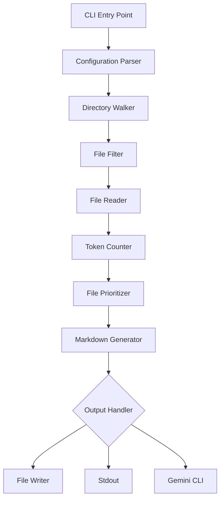

# Architecture Overview

This document describes the high-level architecture of `code-digest`, a high-performance CLI tool for converting codebases to Markdown for LLM context.

## Design Principles

1. **Performance First**: Leverage Rust's performance characteristics and parallel processing
2. **Modularity**: Clear separation of concerns with focused modules
3. **Extensibility**: Easy to add new features without breaking existing functionality
4. **User Experience**: Clear error messages and intuitive CLI interface
5. **LLM Optimization**: Output specifically designed for LLM consumption

## System Architecture



## Core Components

### 1. CLI Interface (`src/cli.rs`)

**Responsibilities:**
- Parse command-line arguments using `clap`
- Load and merge configuration from files
- Validate user input
- Provide help and usage information

**Key Design Decisions:**
- Use derive macros for clean argument definition
- Support both positional arguments and flags
- Allow configuration via file for complex setups

### 2. Directory Walker (`src/core/walker.rs`)

**Responsibilities:**
- Traverse directory structures efficiently
- Apply ignore patterns from `.gitignore` and `.digestignore`
- Handle symbolic links safely
- Detect and skip binary files

**Key Design Decisions:**
- Use `ignore` crate for Git-aware traversal
- Parallel directory scanning with `rayon`
- Stream files rather than collecting all at once
- Skip binary files by detecting null bytes

### 3. Token Counter (`src/core/token.rs`)

**Responsibilities:**
- Count tokens accurately using tiktoken
- Cache token counts for performance
- Support different tokenizer models
- Handle large files efficiently

**Key Design Decisions:**
- Default to cl100k_base encoding (GPT-3.5/4)
- Lazy loading of tokenizer data
- Chunked processing for large files
- Thread-safe caching with `DashMap`

### 4. File Prioritizer (`src/core/prioritizer.rs`)

**Responsibilities:**
- Score files based on importance
- Apply user-defined priority rules
- Ensure essential files are included first
- Handle token budget allocation

**Key Design Decisions:**
- Glob pattern matching for flexibility
- Weight-based scoring system
- Two-pass algorithm: collect then prioritize
- Support for `.digestkeep` essential files

### 5. Markdown Generator (`src/core/digest.rs`)

**Responsibilities:**
- Format files into structured Markdown
- Add appropriate code fence languages
- Generate project structure overview
- Handle special file types

**Key Design Decisions:**
- Include file tree at the beginning
- Use consistent formatting throughout
- Preserve file paths for context
- Support syntax highlighting hints

## Data Flow

1. **Input Phase**
   - CLI arguments parsed
   - Configuration loaded and merged
   - Target directory validated

2. **Discovery Phase**
   - Directory tree traversed
   - Ignore patterns applied
   - Binary files filtered out
   - File metadata collected

3. **Analysis Phase**
   - Files read in parallel
   - Tokens counted per file
   - Priority scores calculated
   - Files sorted by importance

4. **Generation Phase**
   - Project structure generated
   - Files processed in priority order
   - Markdown formatted with syntax hints
   - Token budget tracked

5. **Output Phase**
   - Output directed to appropriate target
   - Progress reported if requested
   - Errors handled gracefully

## Performance Optimizations

### Parallel Processing
- Directory traversal parallelized with `rayon`
- File reading done concurrently
- Token counting distributed across threads

### Memory Efficiency
- Streaming file processing
- Bounded channels for backpressure
- Incremental markdown building
- Smart caching strategies

### I/O Optimization
- Buffered file reading
- Batch writes for output
- Minimal stat calls
- Efficient path handling

## Error Handling Strategy

### Error Types
```rust
pub enum CodeDigestError {
    // File system errors
    InvalidPath(String),
    ReadError(String),
    
    // Configuration errors
    InvalidConfiguration(String),
    ConfigParseError(String),
    
    // Processing errors
    TokenCountError(String),
    MarkdownGenerationError(String),
    
    // External tool errors
    GeminiCliNotFound,
    SubprocessError(String),
}
```

### Error Propagation
- Use `Result<T, CodeDigestError>` throughout
- Convert external errors at boundaries
- Provide context with error messages
- Fail fast for unrecoverable errors

## Extension Points

### Adding New File Types
1. Update `file_ext.rs` with mappings
2. Add special handling in `digest.rs` if needed
3. Update prioritization weights

### Supporting New LLMs
1. Add tokenizer support in `token.rs`
2. Update CLI to select tokenizer
3. Adjust output format if needed

### Custom Processors
1. Define processor trait
2. Implement for specific file types
3. Register in processing pipeline

## Configuration System

### Precedence Order
1. CLI arguments (highest)
2. Project config file (`.code-digest.toml`)
3. User config file (`~/.config/code-digest/config.toml`)
4. Default values (lowest)

### Configuration Schema
```toml
[defaults]
max_tokens = 150000
verbose = false
progress = true

[ignore]
patterns = ["*.log", "*.tmp"]
use_gitignore = true

[[priorities]]
pattern = "**/*.rs"
weight = 100

[output]
include_tree = true
syntax_highlighting = true
```

## Security Considerations

### Path Traversal
- Validate all paths are within project root
- Don't follow symbolic links by default
- Sanitize file paths in output

### Resource Limits
- Cap maximum file size
- Limit total files processed
- Timeout long operations

### External Commands
- Validate gemini-cli presence
- Sanitize inputs to subprocesses
- Handle subprocess failures gracefully

## Testing Strategy

### Unit Tests
- Test each module in isolation
- Mock file system operations
- Verify error handling paths

### Integration Tests
- Test full processing pipeline
- Use fixture directories
- Verify output correctness

### Performance Tests
- Benchmark large repositories
- Profile memory usage
- Track performance regressions

## Future Enhancements

### Near Term
- Progress bars with `indicatif`
- Colored output with `termcolor`
- Config file watching
- Incremental processing

### Long Term
- Web UI for configuration
- Plugin system for processors
- Cloud storage integration
- Distributed processing

## Dependencies Overview

### Core Dependencies
- `clap` - CLI argument parsing
- `ignore` - Git-aware file traversal
- `tiktoken-rs` - Token counting
- `rayon` - Parallel processing

### Error Handling
- `anyhow` - Error propagation
- `thiserror` - Error definitions

### Utilities
- `walkdir` - Directory traversal (via ignore)
- `once_cell` - Lazy statics
- `serde` - Configuration parsing

## Conclusion

The architecture of `code-digest` is designed to be:
- **Fast**: Parallel processing and efficient algorithms
- **Flexible**: Easy to extend and configure
- **Reliable**: Comprehensive error handling
- **User-friendly**: Clear output and helpful errors

This design allows the tool to handle large codebases efficiently while producing high-quality output for LLM consumption.